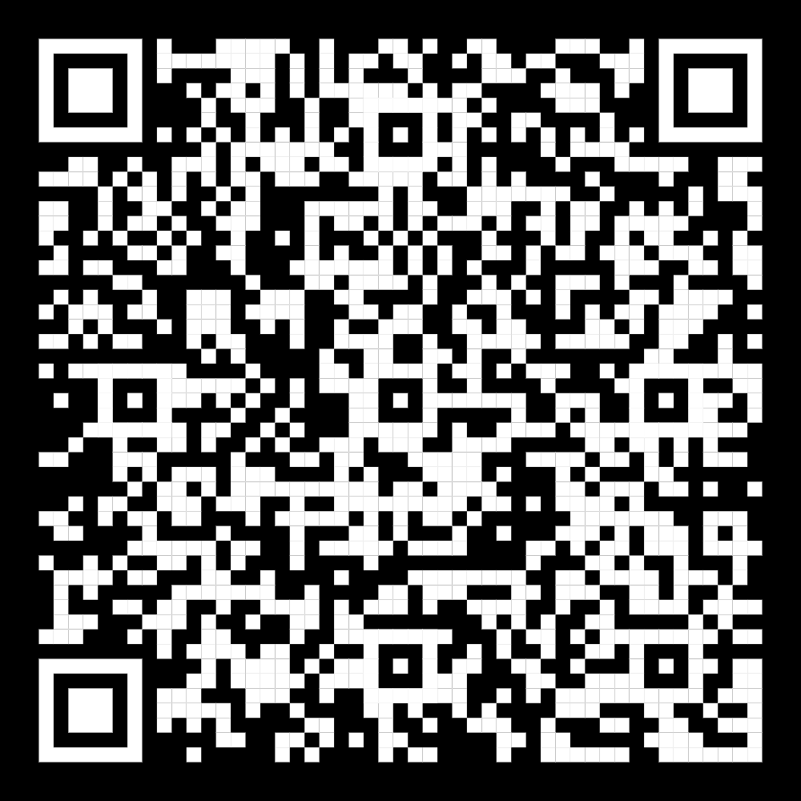

# 📘 Learning FactoryTalk® Optix™ 

#### A set of resources in order to become an FTOptix power user

---

- 🌐 **What is FTOptix?** → [Link](./chapters/FTOptix_overview.md)

- 🚀 **Download, install, start!** → [Link](./chapters/Download_install_start.md)

- 📚 **Learn FTOptix** → [Link](./chapters/Learning_material.md)

- 🛠️ **100 projects examples and scripts for you** → [Link](./chapters/Examples.md)

- 💲 **How to manage my licenses? (ITA)** → [Link](https://www.youtube.com/watch?v=BVXPn04wZ8M&ab_channel=ASEMS.r.l.)

- 💻 **OptixPanels & co** → [Link](./chapters/OptixPanels_and_co.md)
